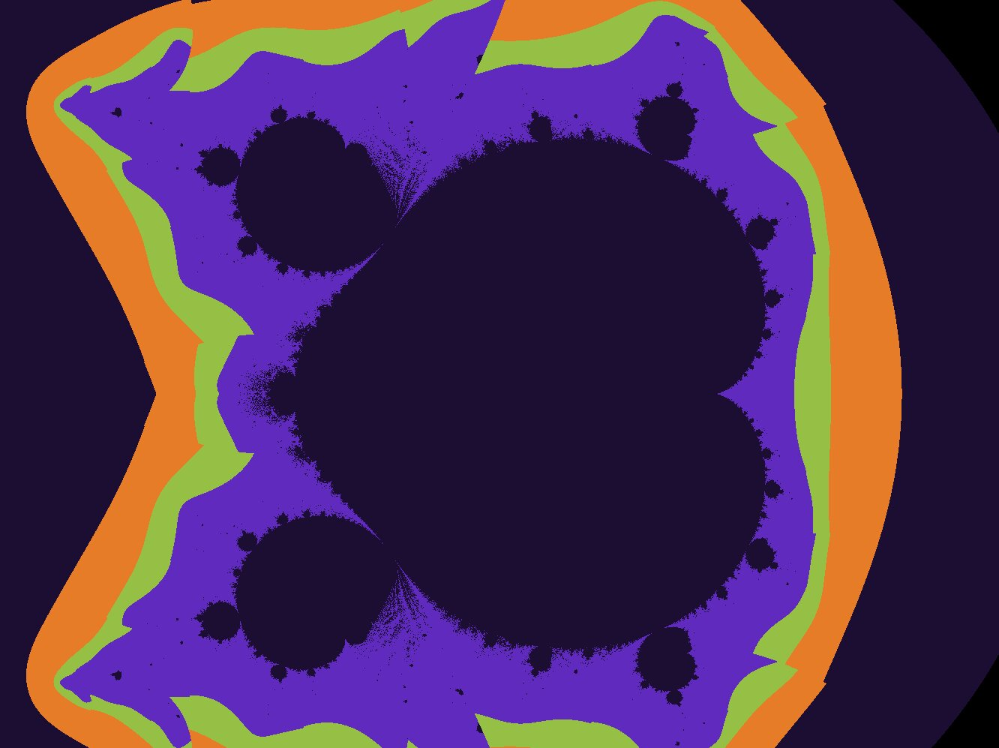
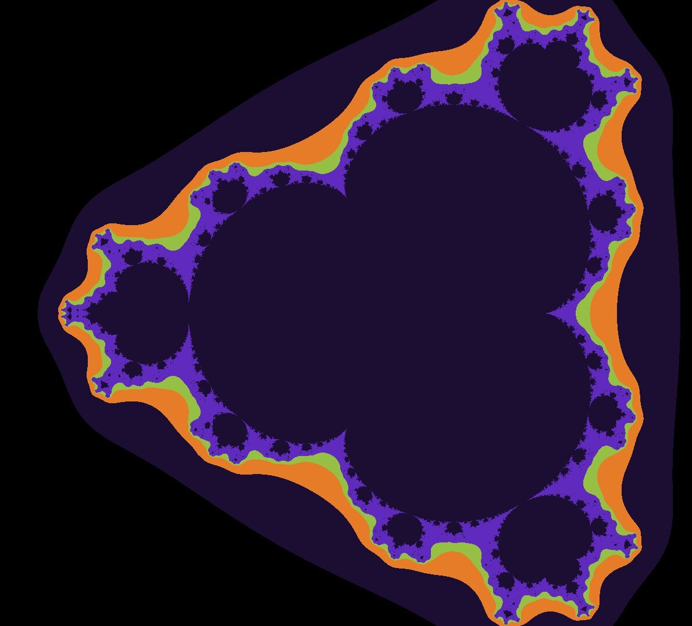
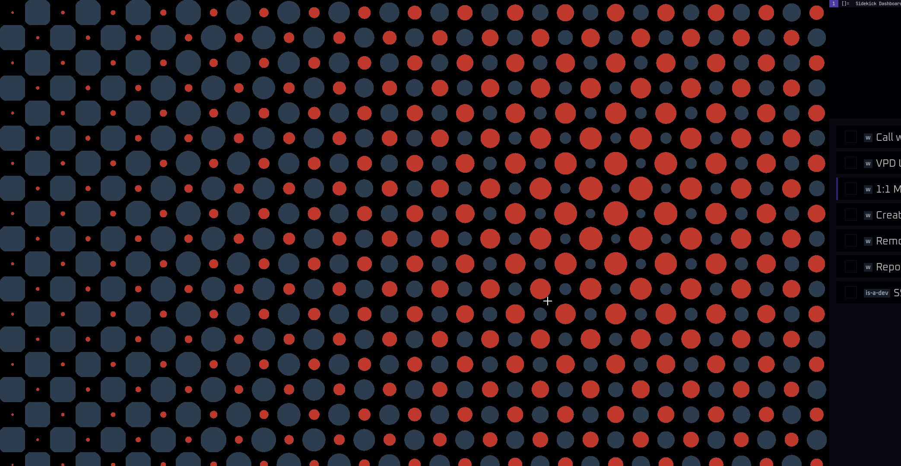
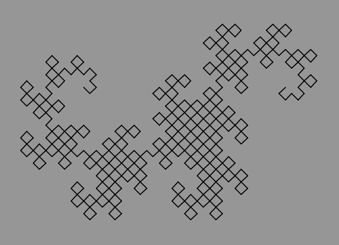
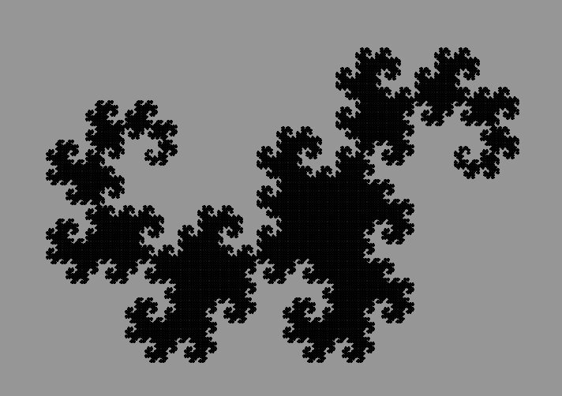

# My playground
Making cool looking things for fun.

## 01: Mandelbrot fractal (Generalized to `z' = z^n + c`)
| | |
|----|----|
|  |  |

## 02: Newton's fractal (`f(z) = z^3 - 1`)

## 03: [WIP]

## 04: Dot animation

## 05: Dragon's curve
| | |
|----|----|
|  |  |

