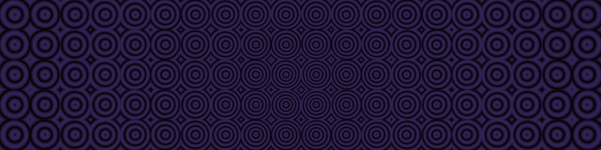

# My playground
Making cool looking things for fun. They're all inside the [sketches](./sketches/) directory.

## 01: Mandelbrot fractal (Generalized to `z' = z^n + c`)
|                                         |                                         |
|-----------------------------------------|-----------------------------------------|
|  |  |

## 02: Newton's fractal (`f(z) = z^3 - 1`)
|                                         |                                         |
|-----------------------------------------|-----------------------------------------|
|  |  |

## 03: [WIP]

## 04: Dot animation

## 05: Dragon's curve
|                                         |                                         |
|-----------------------------------------|-----------------------------------------|
|  |  |

## 06: Magic circlular circles

## 07: 3D Siepinski triangle in desmos [WIP]
Don't know if this is even possible, but I'm gonna try anyway.

